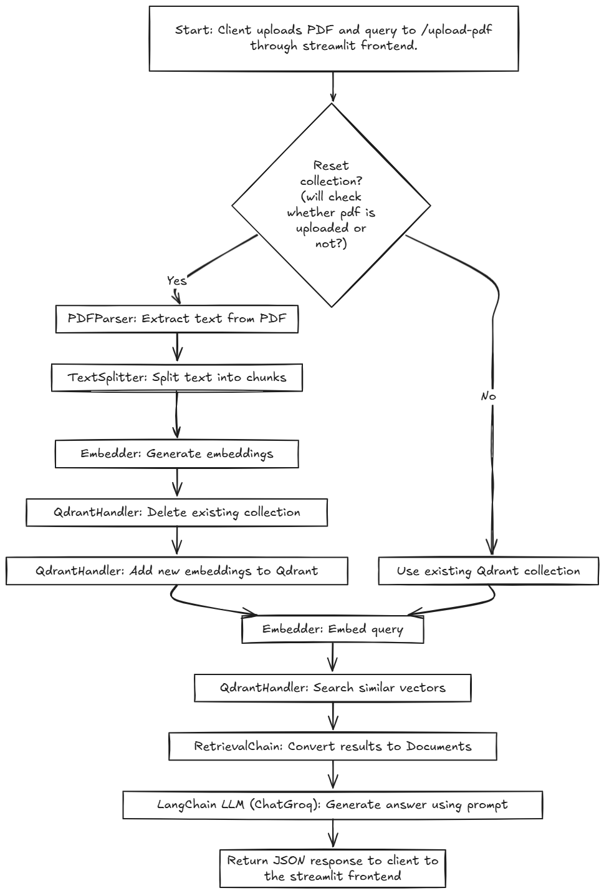
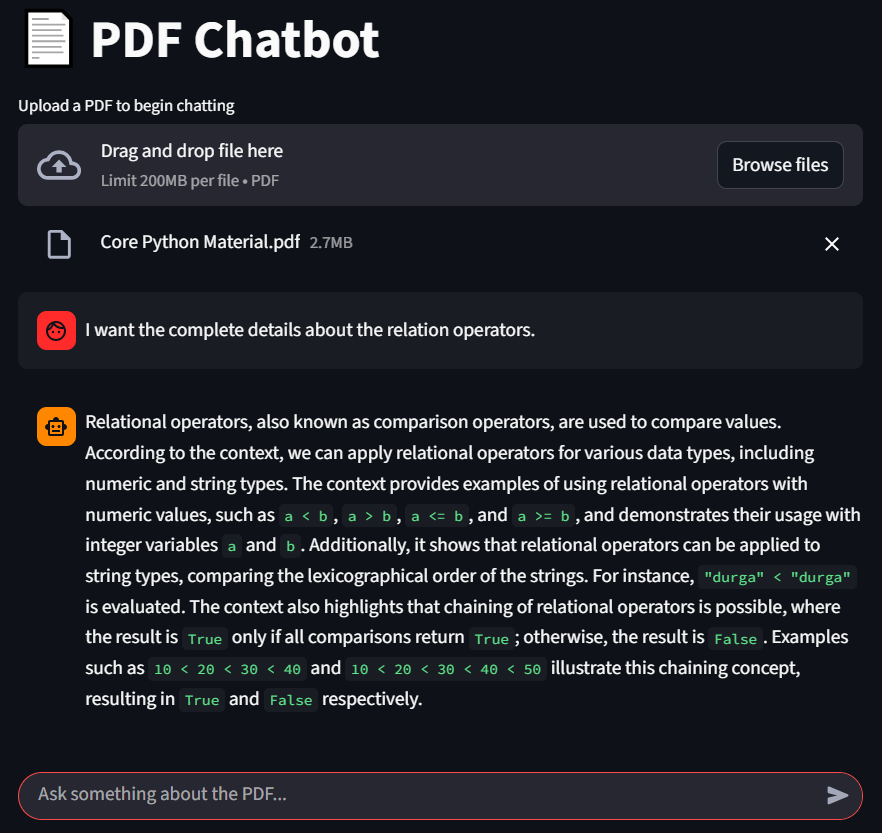
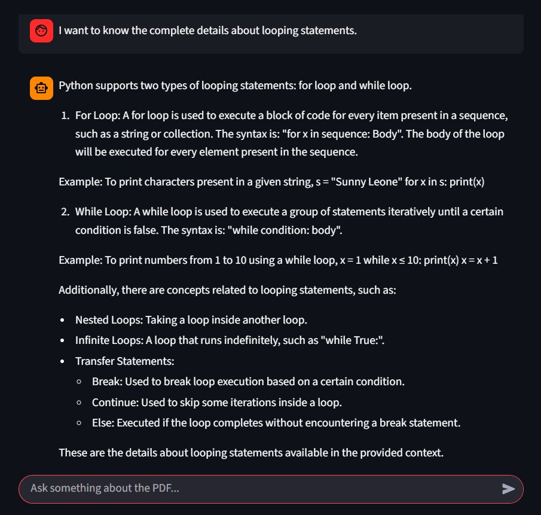
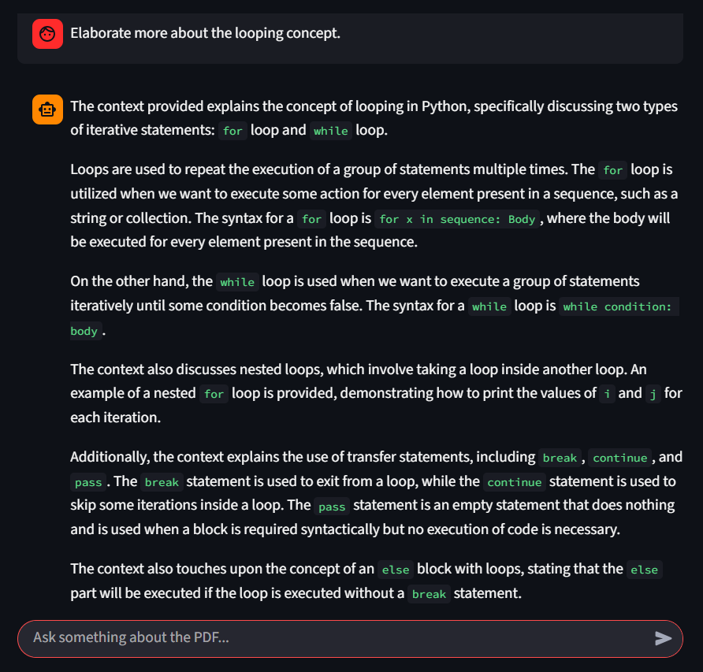

# PDF Q&A Assistant

A web-based chatbot that allows users to upload PDF documents and ask questions about their content. The chatbot leverages **semantic embeddings**, **Qdrant vector database**, and **Groq LLM** to retrieve and generate context-aware answers based on the PDF content.

---

## Table of Contents

- [Features](#features)
- [Architecture](#architecture)
- [Installation](#installation)
- [Environment Variables](#environment-variables)
- [Usage](#usage)
  - [Backend](#backend)
  - [Frontend](#frontend)
- [Project Structure](#project-structure)
- [Core Components](#core-components)
- [Qdrant Integration](#qdrant-integration)
- [Dependencies](#dependencies)
- [Notes](#notes)

---

## Features

- Upload PDFs and extract English text.
- Chunk text intelligently for semantic understanding.
- Generate embeddings using **Sentence Transformers**.
- Store and manage embeddings in **Qdrant** vector database.
- Retrieve relevant content for queries using similarity search.
- Answer user questions using **Groq LLM**.
- Streamlit-based frontend for interactive chat interface.

---

## Architecture



## Installation

### Clone the repository

```bash
git clone https://github.com/yourusername/pdf-chatbot.git
cd pdf-chatbot
```


### Create a virtual environment

```bash
python -m venv venv
source venv/bin/activate  # Linux / Mac
venv\Scripts\activate     # Windows
```


### Install dependencies

```bash
pip install -r requirements.txt
pip install -r Frontend/requirements.txt
```

### Install and run Qdrant locally

```bash
docker run -p 6333:6333 qdrant/qdrant
```

### Environment Variables

Create a .env file in Backend/ (or use example_env.env as a template):

```bash
GROQ_API_KEY=your_groq_api_key_here
```

## Usage
### Backend (Flask API)

Start the backend server:

```bash
cd Backend
python main.py
```


The Flask API runs on http://localhost:5001.

Response:
```bash
{
  "message": "Operation completed successfully",
  "result": "Answer from the chatbot"
}
```

### Frontend (Streamlit)

Run the frontend:

```bash
cd Frontend
streamlit run homepage.py
```

- Upload a PDF (required for first query)

- Enter your question in the chat input

- The assistant will provide context-based answers

## Project Structure
```
PDF Q&A Assistant
    ├── Backend
    │   ├── __pycache__/
    │   ├── embedder.py
    │   ├── example_env.env
    │   ├── main.py
    │   ├── pdf_parser.py
    │   ├── qdrant_handler.py
    │   ├── retrieval_chain.py
    │   └── text_splitter.py
    ├── Db
    │   ├── __pycache__/
    │   └── qdrant_manager.py
    ├── Frontend
    │   ├── homepage.py
    │   └── requirements.txt
    ├── images/
    |   ├── Screenshot1.png
    |   ├── Screenshot2.png
    |   ├── Screenshot3.png
    │   └── Architecture.png
    ├── readme.md
    └── requirements.txt
```


## Core Components
### 1. PDFParser

- Extracts text from uploaded PDFs.

- Filters non-English characters using regex.

### 2. TextSplitter

- Splits text into chunks using RecursiveCharacterTextSplitter.

- Configurable chunk size (default: 1000 tokens) and overlaps (default: 200).

### 3. Embedder

- Uses sentence-transformers (all-MiniLM-L6-v2) to generate embeddings for text chunks and queries.

### 4. QdrantManager / QdrantHandler

- Handles creation, deletion, and storage of embeddings in Qdrant.

- Performs semantic similarity search for user queries.

### 5. RetrievalChain

- Retrieves relevant document chunks from Qdrant.

- Uses ChatGroq LLM to generate answers.

- Answers strictly based on the retrieved context.

## Qdrant Integration

Collection Name: pdf_rag

Vector Size: 384 (matches all-MiniLM-L6-v2)

Distance Metric: Cosine similarity

Operations:

- Add embeddings

- Delete collection

- Semantic search with optional filters

## Dependencies

- Flask

- streamlit

- requests

- PyPDF2

- sentence-transformers

- qdrant-client

- langchain

- langchain-groq

- python-dotenv

## Images


-

-

-

## Notes

Ensure Qdrant is running before starting the backend.

Only English PDFs are fully supported.

Large PDFs may take longer to process initially.

ChatGroq API requires a valid API key.